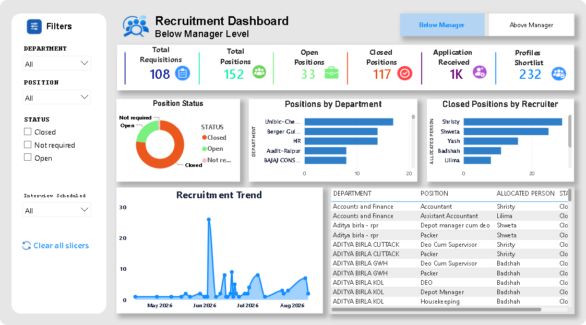
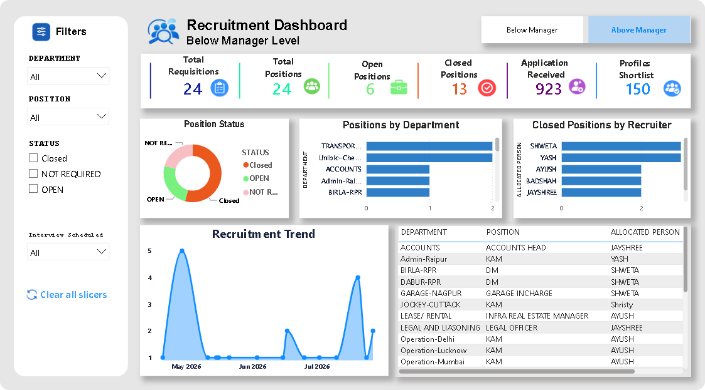
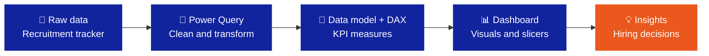

<div align="center">


<br>


<br>

**An interactive Power BI dashboard that tracks hiring demand, the candidate pipeline and recruiter performance, from requisition to closure.**

[Overview](#-overview) • [Preview](#-dashboard-preview) • [Features](#-features) • [KPIs](#-kpi-snapshot) • [Insights](#-key-insights) • [Tech Stack](#-tech-stack) • [How to Use](#-how-to-use)

</div>

## 📌 Overview

Recruitment teams often track hiring in large spreadsheets, which makes simple questions slow to answer. This project turns that tracker into a two-page Power BI dashboard covering **132 requisitions and 176 positions**, split into **Below Manager** and **Above Manager** hiring levels.

It helps HR teams and hiring managers answer:

- How many positions are open, closed or no longer required?
- Which departments have the highest hiring demand?
- How many positions has each recruiter closed?
- How many applications turn into shortlisted profiles?
- How does hiring activity change from month to month?

## 📸 Dashboard Preview

### Below Manager level



### Above Manager level



## ✨ Features

| Component | What it shows |
|---|---|
| **KPI cards** | Total requisitions, total positions, open and closed positions, applications received and profiles shortlisted |
| **Position status** | Donut chart of Open, Closed and Not Required positions |
| **Positions by department** | Bar chart ranking departments by hiring demand |
| **Closed positions by recruiter** | Bar chart comparing closures per recruiter |
| **Recruitment trend** | Area chart of hiring activity over time |
| **Requisition details** | Table of department, position, allocated recruiter and status |
| **Slicers** | Filter by department, position, status and interview scheduled, with one-click *Clear all slicers* |
| **Page navigation** | Buttons to switch between the Below Manager and Above Manager views |

Every visual is cross-filtered: clicking a bar, donut slice or table row filters the rest of the page.

## 📊 KPI Snapshot

| KPI | Below Manager | Above Manager |
|---|:---:|:---:|
| Total requisitions | 108 | 24 |
| Total positions | 152 | 24 |
| Open positions | 33 | 6 |
| Closed positions | 117 | 13 |
| Applications received | ~1K | 923 |
| Profiles shortlisted | 232 | 150 |

## 💡 Key Insights

- **77% of Below Manager positions are closed** (117 of 152), with 33 still open.
- **Senior roles are harder to fill:** only 54% of Above Manager positions are closed (13 of 24).
- **Senior hiring plans change more often:** 5 of 24 Above Manager positions (21%) were marked *Not Required*, compared with just 2 of 152 at Below Manager level.
- **Senior screening is selective:** about 16% of Above Manager applicants were shortlisted (150 of 923).
- **Hiring demand is uneven:** activity spikes sharply in June 2026, so recruiter capacity is worth planning ahead of peak months.

## 🔄 Project Workflow



## 📂 Dataset

The source is a recruitment tracker in Excel where **each row is one hiring requisition**.

<details>
<summary><b>View data dictionary</b></summary>
<br>

| Field | Description |
|---|---|
| Department | Department or site raising the requisition |
| Position | Job role to be filled |
| No. of positions | Openings in the requisition |
| Allocated person | Recruiter handling the requisition |
| Status | Open, Closed or Not Required |
| Date of requisition | Date the hiring request was raised |
| Date of closure | Date the position was closed |
| Target date | Planned date to fill the position |
| Days open | Age of the requisition in days |
| No. of applications | Applications received |
| No. of profiles | Profiles shortlisted |
| No. of interviews | Interviews conducted |
| Interview scheduled | Whether interviews have been scheduled |
| Joined / not joined | Joining status of the selected candidate |
| Pending at | Stage or person the requisition is pending with |

</details>

## 🧰 Tech Stack

| Tool | Used for |
|---|---|
| **Power BI Desktop** | Report design, visuals and interactivity |
| **Power Query** | Loading, cleaning and shaping the data |
| **DAX** | KPI measures such as Total Requisitions, Total Positions, Open Positions, Closed Positions and Profiles Shortlisted |
| **Microsoft Excel** | Source data (recruitment tracker) |

## 🚀 How to Use

1. **Get the file:** clone the repository, or download the `.pbix` directly with the button below.
   ```bash
   git clone https://github.com/Inder616/Recruitment-Analytics-Dashboard.git
   ```
2. **Install** [Power BI Desktop](https://www.microsoft.com/en-us/power-platform/products/power-bi/desktop) (free, Windows).
3. **Open** `Recruitment Analytics Dashboard.pbix`.
4. **Explore:** use the slicers on the left and the page buttons at the top right.

> [!TIP]
> In Power BI Desktop, hold **Ctrl** while clicking a button (such as *Below Manager* or *Above Manager*) to use it.

<p align="center">
  <a href="https://github.com/Inder616/Recruitment-Analytics-Dashboard/raw/main/Recruitment%20Analytics%20Dashboard.pbix">
    
  </a>
</p>

## 📁 Repository Structure

```text
Recruitment-Analytics-Dashboard/
├── images/
│   ├── banner.svg
│   ├── below-manager-dashboard.png
│   └── above-manager-dashboard.png
├── Recruitment Analytics Dashboard.pbix
└── README.md
```

## 🔮 Future Enhancements

- [ ] Time-to-fill analysis using requisition and closure dates
- [ ] Full hiring funnel: applications → shortlisted → interviewed → joined
- [ ] Offer-to-joining ratio and candidate drop-off tracking
- [ ] Drill-through pages for department-level analysis
- [ ] Publish to Power BI Service with scheduled refresh

## 👤 Author

**Inderjeet Sinha**

Open to feedback, collaboration and opportunities. Feel free to connect.

<a href="https://github.com/Inder616"></a>
<a href="https://www.linkedin.com/in/YOUR-LINKEDIN-ID"></a>

<br>

<div align="center">

⭐ If you found this project useful, consider giving it a star.

</div>
